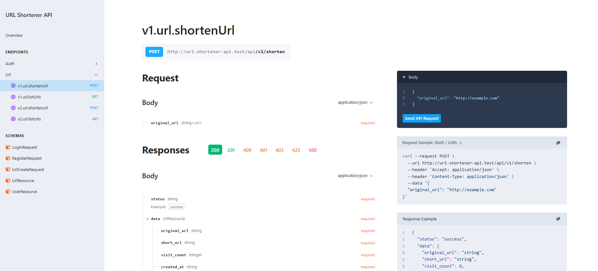

# 🔗 URL Shortening API



A simple yet powerful URL shortening API built with Laravel 11. This API allows users to shorten URLs, retrieve shortened URLs, perform redirections, and track visit statistics (V2). It also includes authentication using **Sanctum** for secure user access.

## ✨ Features

- **User Authentication** (via Laravel Sanctum)
	+ User registration, login, and logout
- **URL Shortening**
	+ Shorten long URLs
	+ Retrieve the URLs shortened by a user
- **URL Redirection**
	+ Redirect users to the original URL using a short link
- **URL Visit Counting** (available in v2 of the API)
- **API Versioning** (v1 and v2)
- Secure, clean, and well-structured API with response messages

## API Endpoints

### Authentication Endpoints
- `POST /api/v1/register`: Register a new user
- `POST /api/v1/login`: User login
- `POST /api/v1/logout`: User logout

- `POST /api/v2/register`: Register a new user
- `POST /api/v2/login`: User login
- `POST /api/v2/logout`: User logout

### URL Endpoints
- `POST /api/v1/shorten`: Shorten a URL
- `GET /api/v1/urls`: List all shortened URLs
- `GET /v1/{short_url}`: Redirect to the original URL from the shortened link

- `POST /api/v2/shorten`: Shorten a URL
- `GET /api/v2/urls`: List all shortened URLs
- `GET /v2/{short_url}`: Redirect to the original URL from the shortened link & counts visit

### API Responses
- Success response: HTTP 200 or 201 with status `success` and relevant data
- Error response: HTTP 400, 401, 404, or 500 with status `error` and relevant error message

## Detailed API Documentation

Detailed API documentation is available at the `/docs/api` route, which was generated using **Scramble**. Visit this route in your browser to view the full documentation, including request and response examples.

---

## 🚀 Getting Started

### 📋 Prerequisites

To run this project, you need to have the following installed:

- PHP 8.2 or higher
- Composer
- Laravel 11
- MySQL or SQLite (for database)
- Laravel Sanctum (for authentication)

### 🔧 Installation Instructions

1. **Clone the Repository**

   ```bash
   git clone https://github.com/ahmad-cit22/url-shortener-api.git
   cd url-shortener-api
   ```

2. **Install Dependencies**

   Run the following command to install all the project dependencies:

   ```bash
   composer install
   ```

3. **Set Up Environment File**

   Copy the example environment file and modify it according to your local setup:

   ```bash
   cp .env.example .env
   ```

   Then, open the `.env` file and update the following configurations:

   - **Database**: Set up your database credentials (`DB_DATABASE`, `DB_USERNAME`, `DB_PASSWORD`).
   - **APP_URL**: Set the app URL to your local development URL, e.g., `http://localhost:8000`.

4. **Generate Application Key**

   ```bash
   php artisan key:generate
   ```

5. **Run Migrations**

   Run the following command to create the necessary database tables:

   ```bash
   php artisan migrate
   ```

6. **Run the Application**

   Start the Laravel development server by running the command:

   ```bash
   php artisan serve
   ```

   The application will now be running at `http://localhost:8000`.
   ```

---

## Usage

### Authentication

To access most endpoints, users must authenticate via Personal Access Tokens using [Sanctum](https://laravel.com/docs/sanctum).

1. **Register a User**: Send a POST request to `/api/v1/register` to create a new user.
2. **Log In**: Send a POST request to `/api/v1/login` to receive a token.
3. **Use the Token**: Include the token in the `Authorization` header as `Bearer {token}` for subsequent requests like shortening URLs, retrieving shortened URLs, logging out, etc.


### Shorten URL

To shorten a URL, send a POST request to `/api/v1/shorten` with the following payload:

```json
{
    "original_url": "https://example.com"
}
```

This will return the shortened URL along with the original URL & the visit count.

### Redirect to Original URL

To redirect to the original URL, simply send a GET request to the shortened URL (authentication not required) like so:

```bash
GET /v1/{short_url}
```

You will be redirected to the original URL.

---

## 🧪 Tests

This project includes various tests to ensure the correct & smooth functionality with reliability of the system. The implemented tests are mentioned below:

### 1. AuthTest
- **File:** `tests/Feature/AuthTest.php`
  - **test_user_can_register:** Ensures that a user can register successfully.
  - **test_user_cannot_register_with_invalid_inputs:** Verifies that a user cannot register with invalid inputs.
  - **test_user_cannot_register_with_duplicate_email:** Confirms that a user cannot register with a duplicate email.
  - **test_user_cannot_register_with_password_confirmation_mismatch:** Checks that a user cannot register with a mismatched password confirmation.
  - **test_user_can_login:** Ensures that a registered user can log in.
  - **test_user_cannot_login_with_invalid_credentials:** Verifies that a user cannot log in with invalid credentials.
  - **test_user_cannot_login_with_missing_credentials:** Confirms that a user cannot log in with missing credentials.
  - **test_user_can_logout:** Ensures that a logged-in user can log out.
  - **test_user_cannot_logout_without_token:** Verifies that a user cannot log out without a valid token.

### 2. UrlV1Test
- **File:** `tests/Feature/UrlV1Test.php`
  - **test_user_can_shorten_url_v1:** Tests the URL shortening functionality for version 1.
  - **test_user_can_list_urls_v1:** Ensures that users can list all shortened URLs in version 1.
  - **test_user_can_redirect_v1:** Verifies that users can redirect to the original URL using version 1 shortened links.

### 3. UrlV2Test
- **File:** `tests/Feature/UrlV2Test.php`
  - **test_user_can_shorten_url_v2:** Tests the URL shortening functionality for version 2.
  - **test_user_can_list_urls_v2:** Ensures that users can list all shortened URLs in version 2.
  - **test_user_can_redirect_and_count_visits_v2:** Verifies that users can redirect to the original URL and that visit counts are tracked in version 2.

### Running Tests
To run the provided tests, you can use the following command:

```bash
php artisan test
```
---


## 📝 Conclusion
This project demostrates an effiecient URL shortening API built with Laravel 11, adhering to the best practices of software development. The application is optimized for performance and can be expanded with additional features and analytics capabilities.

If you have any issues running the application or have suggestions for improvement, please don't hesitate to reach out. I'm always looking for ways to enhance the project and make it more valuable to users.


